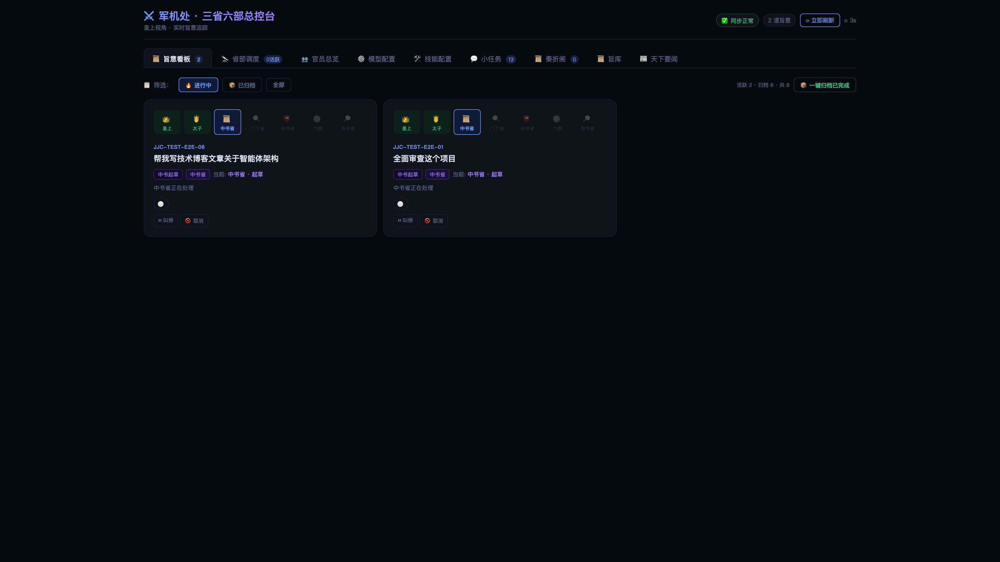
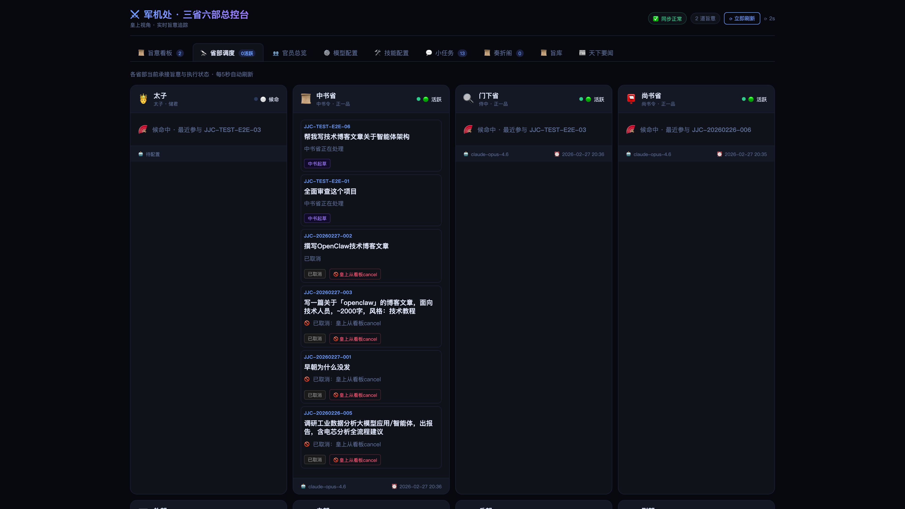
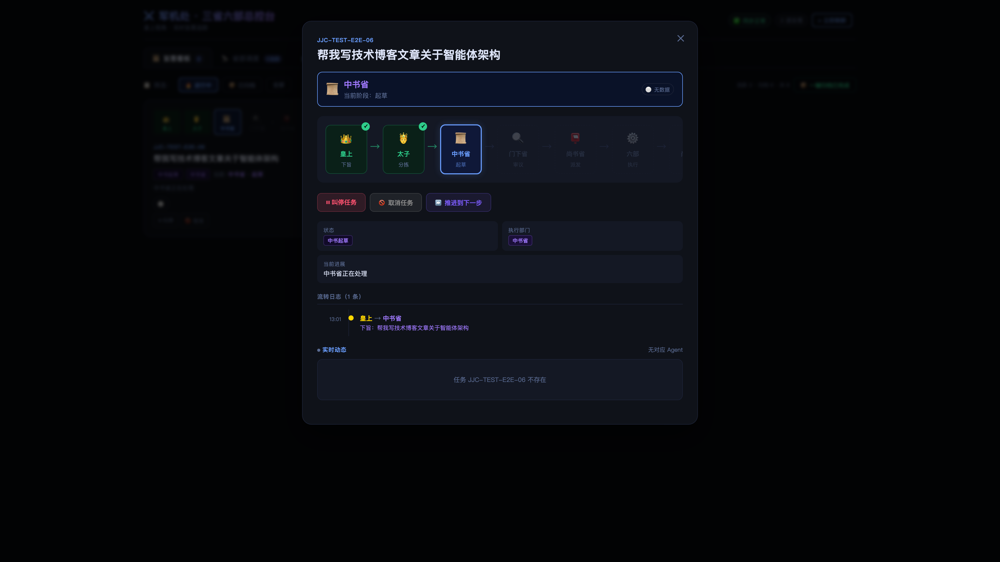
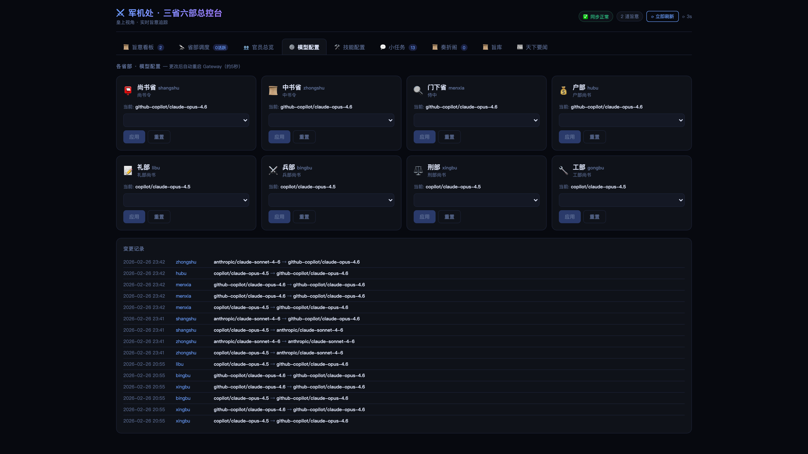
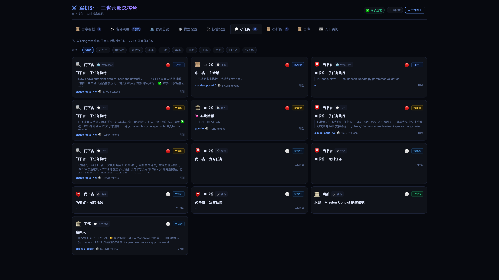
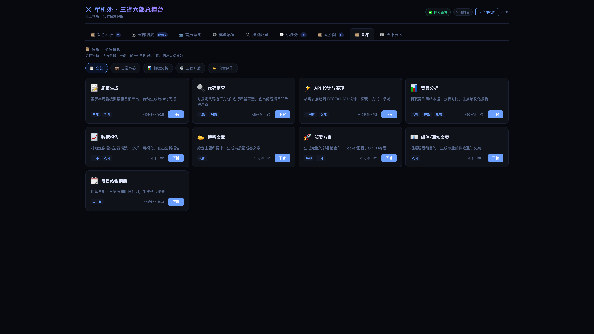

<h1 align="center">⚔️ Edict · マルチエージェント・オーケストレーション</h1>

<p align="center">
  <strong>中国1,300年の帝国統治をモデルにしたAIマルチエージェントシステムを構築しました。<br>古代の官僚制度は、現代のAIフレームワークよりも三権分立を深く理解していたのです。</strong>
</p>

<p align="center">
  <sub>12のAIエージェント（11の業務ロール＋1の互換ロール）が三省六部を構成：太子が振り分け、中書省が立案、門下省が審査、尚書省が配分、六部が実行。<br>CrewAIにはない<b>制度的レビューゲート</b>。AutoGenにはない<b>リアルタイムダッシュボード</b>。</sub>
</p>

<p align="center">
  <a href="#-デモ">🎬 デモ</a> ·
  <a href="#-クイックスタート">🚀 クイックスタート</a> ·
  <a href="#️-アーキテクチャ">🏛️ アーキテクチャ</a> ·
  <a href="#-機能">📋 機能</a> ·
  <a href="README.md">中文</a> ·
  <a href="README_EN.md">English</a> ·
  <a href="CONTRIBUTING.md">Contributing</a>
</p>

<p align="center">
  
  
  
  
  
  
</p>

<p align="center">
  
</p>

---

## 🎬 デモ

<p align="center">
  <video src="docs/Agent_video_Pippit_20260225121727.mp4" width="100%" autoplay muted loop playsinline controls>
    お使いのブラウザは動画再生に対応していません。下のGIFをご覧いただくか、<a href="docs/Agent_video_Pippit_20260225121727.mp4">動画をダウンロード</a>してください。
  </video>
  <br>
  <sub>🎥 フルデモ：三省六部によるAIマルチエージェント協調</sub>
</p>

<details>
<summary>📸 GIFプレビュー（読み込みが速い）</summary>
<p align="center">
  
  <br>
  <sub>勅令発布 → 太子振り分け → 中書省立案 → 門下省審査 → 六部実行 → 回奏（30秒）</sub>
</p>
</details>

> 🐳 **OpenClawをお持ちでない場合** `docker run -p 7891:7891 cft0808/edict` を実行すれば、シミュレーションデータでダッシュボード全機能をお試しいただけます。

---

## 💡 コンセプト

多くのマルチエージェントフレームワークでは、AIエージェントが自由に会話し、監査や介入が困難な不透明な結果を生み出します。**Edict** は根本的に異なるアプローチを取ります — 中国を1,400年間統治した行政システムを借用しています：

```
あなた（皇帝） → 太子（振り分け） → 中書省（立案） → 門下省（審査） → 尚書省（配分） → 六部（実行） → 回奏
   皇上              太子               中書省           門下省            尚書省            六部          回奏
```

これは単なる比喩ではありません。AIのための**真の三権分立**です：

- **太子（Crown Prince）** がメッセージを振り分け — 雑談は自動返信、実際の指令はタスク化
- **中書省（Planning）** が指令を実行可能なサブタスクに分解
- **門下省（Review）** が計画を監査 — 却下して再立案を強制可能
- **尚書省（Dispatch）** が承認済みタスクを専門部署に割り当て
- **七部** が並列で実行、それぞれ異なる専門性を持つ
- **データサニタイズ** がファイルパス、メタデータ、不要データをタスクタイトルから自動除去
- すべてが**リアルタイムダッシュボード**を通じて流れ、監視・介入が可能

---

## 🤔 なぜEdictなのか？

> **「1つのAIがすべてを間違えるのではなく、9つの専門エージェントが互いの成果をチェックします。」**

| | CrewAI | MetaGPT | AutoGen | **Edict** |
|---|:---:|:---:|:---:|:---:|
| **レビュー/拒否権の組み込み** | ❌ | ⚠️ | ⚠️ | **✅ 専任レビュアー** |
| **リアルタイムかんばん** | ❌ | ❌ | ❌ | **✅ 10パネルダッシュボード** |
| **タスク介入** | ❌ | ❌ | ❌ | **✅ 停止 / キャンセル / 再開** |
| **完全な監査証跡** | ⚠️ | ⚠️ | ❌ | **✅ 奏摺アーカイブ** |
| **エージェント健全性監視** | ❌ | ❌ | ❌ | **✅ ハートビート検知** |
| **LLMモデルのホットスワップ** | ❌ | ❌ | ❌ | **✅ ダッシュボードから切替** |
| **スキル管理** | ❌ | ❌ | ❌ | **✅ 閲覧 / 追加** |
| **ニュース集約** | ❌ | ❌ | ❌ | **✅ デイリーダイジェスト + Webhook** |
| **セットアップの複雑さ** | 中 | 高 | 中 | **低 · ワンクリック / Docker** |

> **コアの差別化要素：制度的レビュー + 完全な可観測性 + リアルタイム介入**

<details>
<summary><b>🔍 なぜ「門下省（Review Department）」がキラー機能なのか（クリックで展開）</b></summary>

<br>

CrewAIやAutoGenのエージェントは**「完了、出荷」**モードで動作します — 出力の品質を誰もチェックしません。QA部門のない会社でエンジニアがコードを直接本番にプッシュするようなものです。

Edictの**門下省（Review Department）** はまさにこのために存在します：

- 📋 **計画品質の監査** — 中書省の分解は完全かつ妥当か？
- 🚫 **低品質な出力の拒否** — 警告ではなく、再立案を強制するハードリジェクト
- 🔄 **必須やり直しループ** — 基準を満たすまで何も通過しない

これはオプションのプラグインではありません — **アーキテクチャの一部**です。すべての指令は門下省を通過しなければなりません。例外はありません。

複雑なタスクでEdictが信頼性の高い結果を出せるのはこのためです：実行に到達する前に必須の品質ゲートがあります。唐の太宗は1,300年前にこれを理解していました — **チェックされない権力は必ず誤りを生む**のです。

</details>

---

## ✨ 機能

### 🏛️ 十二部エージェントアーキテクチャ
- **太子**（Crown Prince）メッセージ振り分け — 雑談は自動返信、実際の指令はタスク作成
- **三省**（中書省・門下省・尚書省）による統治
- **七部**（戸部・礼部・兵部・刑部・工部・吏部・朝報）による実行
- 厳格な権限マトリクス — 誰が誰にメッセージを送れるかを強制
- 各エージェント：独自のワークスペース、スキル、LLMモデル
- **データサニタイズ** — ファイルパス、メタデータ、無効なプレフィックスをタイトル/備考から自動除去

### 📋 コマンドセンター・ダッシュボード（10パネル）

| パネル | 説明 |
|--------|------|
| 📋 **勅令かんばん** | 状態別タスクカード、フィルター、検索、ハートビートバッジ、停止/キャンセル/再開 |
| 🔭 **部署モニター** | パイプライン可視化、分布チャート、ヘルスカード |
| 📜 **奏摺アーカイブ** | 5フェーズタイムラインの自動生成アーカイブ |
| 📜 **勅令テンプレート** | 9つのプリセット＋パラメータフォーム、コスト見積もり、ワンクリック発令 |
| 👥 **官員一覧** | トークンリーダーボード、活動統計 |
| 📰 **朝報ブリーフィング** | 自動キュレーションニュース、購読管理、Feishuプッシュ |
| ⚙️ **モデル設定** | エージェント別LLM切替、Gateway自動再起動 |
| 🛠️ **スキル設定** | インストール済みスキルの表示、新規追加 |
| 💬 **セッション** | チャネルラベル付きリアルタイムセッション監視 |
| 🎬 **朝議セレモニー** | 統計付き没入型デイリーオープニングアニメーション |

---

## 🖼️ スクリーンショット

### 勅令かんばん


<details>
<summary>📸 その他のスクリーンショット</summary>

### エージェントモニター


### タスク詳細


### モデル設定


### スキル


### 官員一覧


### セッション


### 奏摺アーカイブ


### 勅令テンプレート


### 朝報ブリーフィング


### 朝議セレモニー


</details>

---

## 🚀 クイックスタート

### Docker

```bash
docker run -p 7891:7891 cft0808/edict
```
http://localhost:7891 を開く

### フルインストール

**前提条件:** [OpenClaw](https://openclaw.ai) · Python 3.9+ · macOS/Linux

```bash
git clone https://github.com/cft0808/edict.git
cd edict
chmod +x install.sh && ./install.sh
```

インストーラーが自動的に以下を行います：
- 全部署のワークスペースを作成（`~/.openclaw/workspace-*`、太子/吏部/朝報を含む）
- 各部署のSOUL.mdパーソナリティファイルを作成
- エージェント＋権限マトリクスを`openclaw.json`に登録
- データディレクトリの初期化＋初回同期
- Gatewayの再起動

### 起動

```bash
# ターミナル1：データ同期ループ（15秒間隔）
bash scripts/run_loop.sh

# ターミナル2：ダッシュボードサーバー
python3 dashboard/server.py

# ブラウザを開く
open http://127.0.0.1:7891
```

> 📖 詳細なウォークスルーは[スタートガイド](docs/getting-started.md)をご覧ください。

---

## 🏛️ アーキテクチャ

```
                           ┌───────────────────────────────────┐
                           │         👑 皇帝（あなた）           │
                           │     Feishu · Telegram · Signal     │
                           └─────────────────┬─────────────────┘
                                             │ 勅令発布
                           ┌─────────────────▼─────────────────┐
                           │        👑 太子（Crown Prince）       │
                           │   振り分け：雑談→返信 / 指令→タスク    │
                           └─────────────────┬─────────────────┘
                                             │ 勅令転送
                           ┌─────────────────▼─────────────────┐
                           │       📜 中書省（Planning Dept）      │
                           │      受領 → 立案 → 分解              │
                           └─────────────────┬─────────────────┘
                                             │ 審査提出
                           ┌─────────────────▼─────────────────┐
                           │       🔍 門下省（Review Dept）        │
                           │      監査 → 承認 / 却下 🚫            │
                           └─────────────────┬─────────────────┘
                                             │ 承認 ✅
                           ┌─────────────────▼─────────────────┐
                           │      📮 尚書省（Dispatch Dept）       │
                           │    割当 → 調整 → 収集                │
                           └───┬──────┬──────┬──────┬──────┬───┘
                               │      │      │      │      │
                         ┌─────▼┐ ┌───▼───┐ ┌▼─────┐ ┌───▼─┐ ┌▼─────┐
                         │💰 戸部│ │📝 礼部│ │⚔️ 兵部│ │⚖️ 刑部│ │🔧 工部│
                         │Finance│ │ Docs │ │ Eng. │ │ Law │ │ Ops  │
                         └──────┘ └──────┘ └──────┘ └─────┘ └──────┘
                                                               ┌──────┐
                                                               │📋 吏部│
                                                               │  HR  │
                                                               └──────┘
```

### エージェントの役割

| 部署 | エージェントID | 役割 | 専門分野 |
|------|---------------|------|----------|
| 👑 **太子** | `taizi` | 振り分け、要約 | 雑談検出、意図抽出 |
| 📜 **中書省** | `zhongshu` | 受領、立案、分解 | 要件定義、アーキテクチャ |
| 🔍 **門下省** | `menxia` | 監査、門番、拒否権 | 品質、リスク、基準 |
| 📮 **尚書省** | `shangshu` | 割当、調整、収集 | スケジューリング、追跡 |
| 💰 **戸部** | `hubu` | データ、リソース、経理 | データ処理、レポート |
| 📝 **礼部** | `libu` | 文書、基準、報告書 | テクニカルライティング、APIドキュメント |
| ⚔️ **兵部** | `bingbu` | コード、アルゴリズム、チェック | 開発、コードレビュー |
| ⚖️ **刑部** | `xingbu` | セキュリティ、コンプライアンス、監査 | セキュリティスキャン |
| 🔧 **工部** | `gongbu` | CI/CD、デプロイ、ツール | Docker、パイプライン |
| 📋 **吏部** | `libu_hr` | エージェント管理、研修 | 登録、権限管理 |
| 🌅 **朝報** | `zaochao` | デイリーブリーフィング、ニュース | 定期レポート、要約 |

### 権限マトリクス

| 送信元 ↓ \ 送信先 → | 太子 | 中書省 | 門下省 | 尚書省 | 六部 |
|:---:|:---:|:---:|:---:|:---:|:---:|
| **太子** | — | ✅ | | | |
| **中書省** | ✅ | — | ✅ | ✅ | |
| **門下省** | | ✅ | — | ✅ | |
| **尚書省** | | ✅ | ✅ | — | ✅ 全部 |
| **六部** | | | | ✅ | |

### ステートマシン

```
皇帝 → 太子振り分け → 中書省立案 → 門下省審査 → 割当 → 実行中 → ✅ 完了
                           ↑          │                       │
                           └── 却下 ──┘              ブロック ──
```

---

## 📁 プロジェクト構成

```
edict/
├── agents/                     # 12エージェントのパーソナリティテンプレート（SOUL.md）
│   ├── taizi/                  #   太子（振り分け）
│   ├── zhongshu/               #   中書省
│   ├── menxia/                 #   門下省
│   ├── shangshu/               #   尚書省
│   ├── hubu/ libu/ bingbu/     #   戸部 / 礼部 / 兵部
│   ├── xingbu/ gongbu/         #   刑部 / 工部
│   ├── libu_hr/                #   吏部
│   └── zaochao/                #   朝報
├── dashboard/
│   ├── dashboard.html          # ダッシュボード（単一ファイル、依存関係ゼロ、すぐに使える）
│   ├── dist/                   # ビルド済みReactフロントエンド（Dockerイメージに含む）
│   └── server.py               # APIサーバー（stdlib、依存関係ゼロ）
├── scripts/                    # データ同期＆自動化スクリプト
│   ├── kanban_update.py        #   かんばんCLI（データサニタイズ付き、約300行）
│   └── ...                     #   fetch_morning_news、sync、screenshotsなど
├── tests/                      # E2Eテスト
│   └── test_e2e_kanban.py      #   かんばんサニタイズテスト（17アサーション）
├── data/                       # ランタイムデータ（gitignore対象）
├── docs/                       # ドキュメント＋スクリーンショット
├── install.sh                  # ワンクリックインストーラー
└── LICENSE                     # MIT
```

---

## 🔧 技術的ハイライト

| | |
|---|---|
| **React 18フロントエンド** | TypeScript + Vite + Zustand、13コンポーネント |
| **stdlibバックエンド** | `server.py`（`http.server`ベース、依存関係ゼロ） |
| **エージェント思考の可視化** | エージェントの思考、ツール呼び出し、結果をリアルタイム表示 |
| **ワンクリックインストール** | ワークスペース作成からGateway再起動まで |
| **15秒自動同期** | カウントダウン付きライブデータリフレッシュ |
| **朝議セレモニー** | 没入型オープニングアニメーション |

---

## 🗺️ ロードマップ

> コントリビューション機会を含む完全なロードマップ：[ROADMAP.md](ROADMAP.md)

### フェーズ1 — コアアーキテクチャ ✅
- [x] 十二部エージェントアーキテクチャ＋権限管理
- [x] 太子振り分けレイヤー（雑談 vs タスクの自動ルーティング）
- [x] リアルタイムダッシュボード（10パネル）
- [x] タスク停止 / キャンセル / 再開
- [x] 奏摺アーカイブ（5フェーズタイムライン）
- [x] 勅令テンプレートライブラリ（9プリセット）
- [x] 朝議セレモニーアニメーション
- [x] デイリーニュース＋Feishu Webhookプッシュ
- [x] LLMモデルのホットスワップ＋スキル管理
- [x] 官員一覧＋トークン統計
- [x] セッション監視
- [x] 勅令データサニタイズ（タイトル/備考のクリーニング、不正データの拒否）
- [x] 重複タスク上書き保護
- [x] E2Eかんばんテスト（17アサーション）

### フェーズ2 — 制度的深化 🚧
- [ ] 御裁可モード（ヒューマン・イン・ザ・ループ）
- [ ] 功過簿（エージェントスコアリング）
- [ ] 急使（エージェント間メッセージ可視化）
- [ ] 翰林院（ナレッジベース＋引用）

### フェーズ3 — エコシステム
- [ ] Docker Compose＋デモイメージ
- [ ] Notion / Linearアダプター
- [ ] 年次考課（年間パフォーマンスレポート）
- [ ] モバイルレスポンシブ＋PWA
- [ ] ClawHubマーケットプレイス掲載

---

## 🤝 コントリビューション

あらゆる貢献を歓迎します！[CONTRIBUTING.md](CONTRIBUTING.md)をご覧ください

- 🎨 **UI** — テーマ、レスポンシブ、アニメーション
- 🤖 **新エージェント** — 専門ロール
- 📦 **スキル** — 部署専用パッケージ
- 🔗 **インテグレーション** — Notion · Jira · Linear · GitHub Issues
- 🌐 **i18n** — 日本語 · 韓国語 · スペイン語
- 📱 **モバイル** — レスポンシブ、PWA

---

## 📖 使用例

`examples/`ディレクトリには実際のエンドツーエンドのユースケースが含まれています：

| 使用例 | コマンド | 部署 |
|--------|---------|------|
| [競合分析](examples/competitive-analysis.md) | 「CrewAI vs AutoGen vs LangGraphを分析せよ」 | 中書省→門下省→戸部+兵部+礼部 |
| [コードレビュー](examples/code-review.md) | 「このFastAPIコードのセキュリティ問題をレビューせよ」 | 中書省→門下省→兵部+刑部 |
| [週次レポート](examples/weekly-report.md) | 「今週のエンジニアリングチームレポートを生成せよ」 | 中書省→門下省→戸部+礼部 |

各ケースには以下が含まれます：完全なコマンド → 中書省の提案 → 門下省のフィードバック → 六部の出力 → 最終レポート。

---

## 📄 ライセンス

[MIT](LICENSE) · [OpenClaw](https://openclaw.ai) コミュニティによって構築

---

## 📮 WeChat · 舞台裏

> *古代中国では、「邸報」が帝国全土に勅令を届けました。今日、私たちにはWeChatアカウントがあります。*

<p align="center">
  
  <br>
  <b>スキャンしてフォロー · cft0808</b>
</p>

ここで見つかるもの：
- 🏛️ アーキテクチャの深掘り — 12エージェントがどのように三権分立を実現するか
- 🔥 実戦記 — エージェントが争い、トークンを消費し、ストライキを起こした時の話
- 💡 トークン節約のコツ — フルパイプラインを1/10のコストで運用
- 🎭 SOUL.mdの裏側 — AIエージェントにキャラクターを維持させるプロンプトの書き方

---

## ⭐ スター履歴

[](https://star-history.com/#cft0808/edict&Date)

---

<p align="center">
  <strong>⚔️ 古代帝国の知恵でAIを統治する</strong><br>
  <sub>以古制御新技，以智慧驾驭 AI</sub><br><br>
  <a href="#-wechat--舞台裏"></a>
</p>
