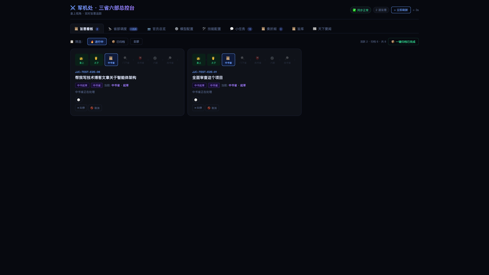
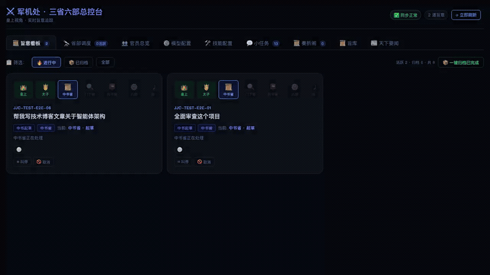
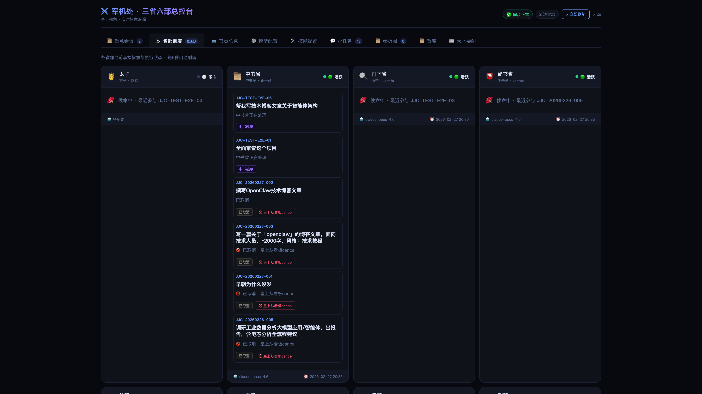
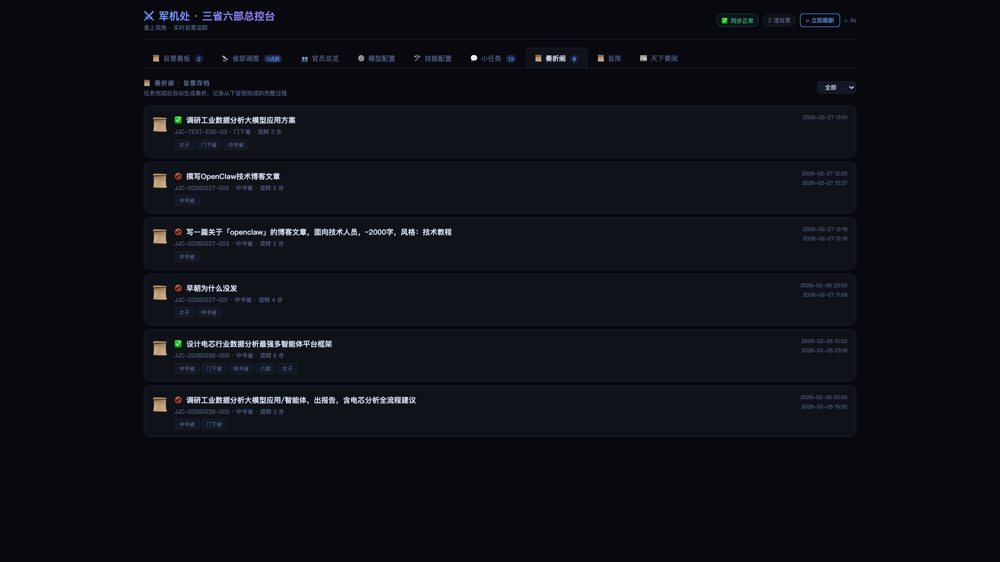
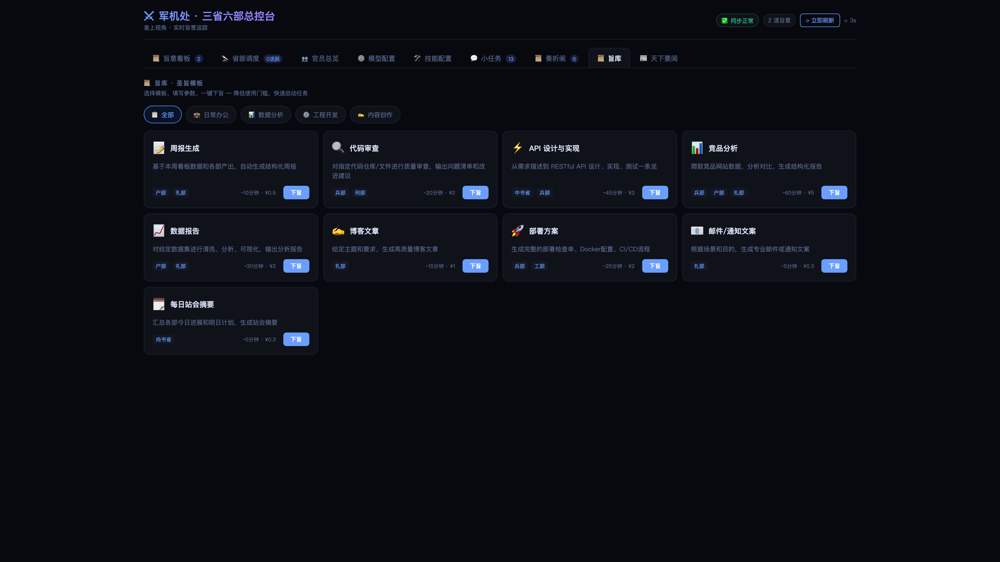
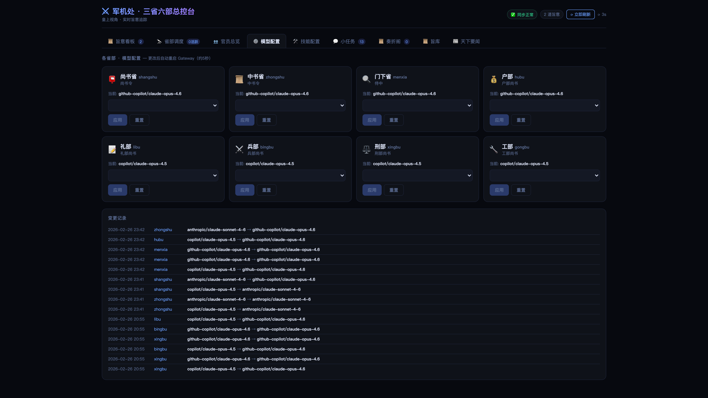
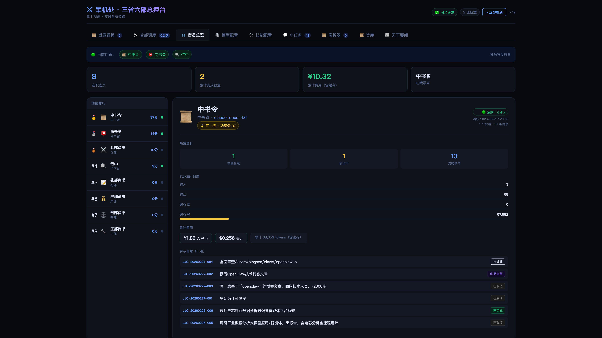
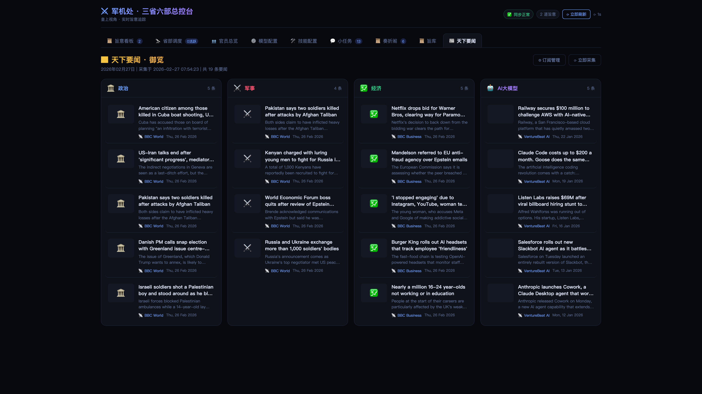
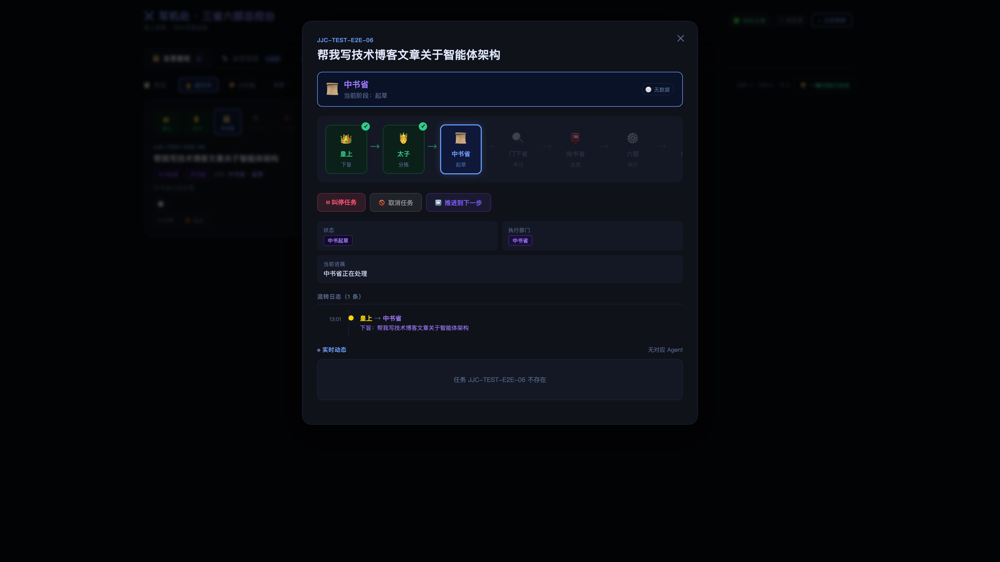
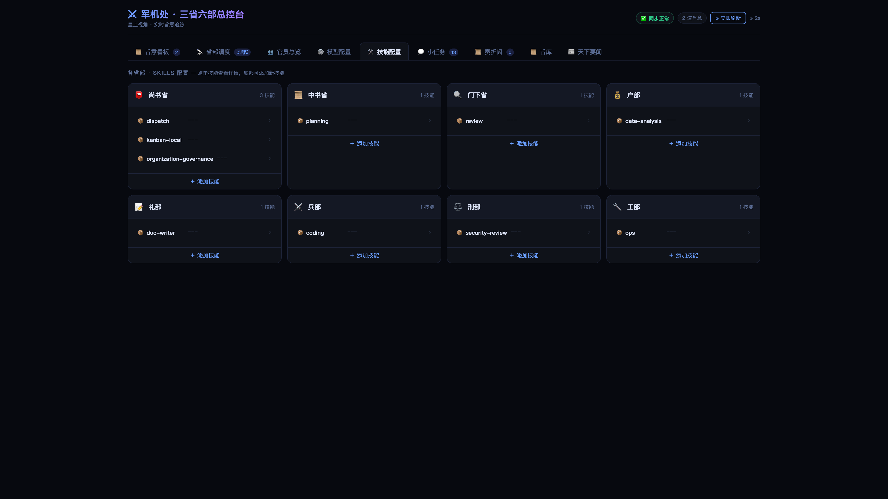

# 我用三省六部制重新设计了 AI 多 Agent 协作架构

> 1300 年前的制度设计，比现代 AI 框架更懂分权。



---

## 一、一个奇怪的想法

去年底我开始重度使用 AI Agent 干活——写代码、做分析、生成文档。用的是市面上最火的几个多 Agent 框架。

用了一个月，我发现一个根本性的问题：

**这些框架没有"审核"这个概念。**

CrewAI 的模式是：几个 Agent 各自干活，做完就交。AutoGen 好一点，有个 Human-in-the-loop，但本质上是你自己当 QA。MetaGPT 有角色分工，但审核是可选的。

就像一家公司没有 QA 部门，工程师写完代码直接部署到线上。

然后你拿到最终结果，不知道中间发生了什么，无法复现，无法审计，无法干预。出了问题只能重跑。

我一直在想：有没有一种架构，天然就把审核嵌入到流程里，不是可选的插件，而是必须经过的关卡？

然后有一天，我在翻《资治通鉴》的时候突然想到——

**三省六部制。**

唐太宗在 1300 年前就设计了这个制度：中书省草拟政令，门下省审议封驳，尚书省执行。三个部门互相制衡，任何政令必须经过审议才能下发。

这不就是我要找的架构吗？


*▲ 每天第一次打开看板，会有一个"上朝"开场动画——仪式感拉满*

---

## 二、古人的架构设计

三省六部制不是一个 metaphor，它是一套经过 1400 年实践检验的分权制衡系统。

简化一下，信息流是这样的：

```
皇上（你）
  ↓ 下旨
中书省（规划）  ← 把你的一句话拆成可执行的子任务
  ↓ 提交审核
门下省（审议）  ← 审查方案质量，不行就封驳打回
  ↓ 准奏
尚书省（派发）  ← 分配给六部执行
  ↓
六部（执行）    ← 户部管数据、礼部管文档、兵部管开发、刑部管合规、工部管基建
  ↓
尚书省汇总回奏  ← 结果回报给你
```

注意这里最关键的一步：**门下省审议**。

中书省规划完方案后，不是直接扔给执行层——必须先经过门下省审议。门下省会检查：

- 子任务拆解是否合理？有没有遗漏需求？
- 部门分配是否准确？该派兵部的是不是错派给了礼部？
- 方案是否可执行？有没有不切实际的地方？

如果不合格，门下省可以**封驳**——直接打回让中书省重新规划。不是一个 warning，是强制返工。

这就是为什么唐朝能运转 289 年。**不受制约的权力必然会出错**，唐太宗想得很清楚。

---

## 三、我把它做成了开源项目

我用 OpenClaw 搭了一个真正的三省六部系统。9 个 AI Agent 各司其职，严格按照权限矩阵通信。

项目叫 **Edict（三省六部）**，已开源：

**GitHub：https://github.com/cft0808/edict**

核心架构很简单：

- **中书省**：接旨（你的指令），规划方案，拆解子任务
- **门下省**：审议方案，质量把关，不合格直接封驳
- **尚书省**：准奏后派发给六部，协调执行，汇总结果
- **六部**：户部（数据分析）、礼部（文档撰写）、兵部（代码开发）、刑部（安全合规）、工部（CI/CD 部署）
- **早朝官**：每天给你推一份新闻简报

每个 Agent 有独立的 Workspace、独立的 Skills、独立的 LLM 模型。严格的权限矩阵——谁能给谁发消息，白纸黑字：

| 谁 ↓ 给谁发 → | 中书 | 门下 | 尚书 | 六部 |
|:---:|:---:|:---:|:---:|:---:|
| **中书省** | — | ✅ | ✅ | ❌ |
| **门下省** | ✅ | — | ✅ | ❌ |
| **尚书省** | ✅ | ✅ | — | ✅ |
| **六部** | ❌ | ❌ | ✅ | ❌ |

中书省不能直接指挥六部，六部不能越级上报中书省。所有的跨层通信必须经过尚书省中转。

**这不是装饰性的设定，这是架构层面的强制约束。**


*▲ 30 秒 Demo：从上朝仪式到旨意看板、奏折归档、模型配置的完整巡览*

---

## 四、跟现有框架对比

你可能会问：跟 CrewAI、AutoGen 比，差在哪？

| | CrewAI | AutoGen | **三省六部** |
|---|:---:|:---:|:---:|
| 审核机制 | ❌ | ⚠️ 可选 | ✅ 门下省强制审核 |
| 实时看板 | ❌ | ❌ | ✅ 10 个面板 |
| 任务干预 | ❌ | ❌ | ✅ 叫停 / 取消 / 恢复 |
| 流转审计 | ⚠️ | ❌ | ✅ 完整奏折存档 |
| Agent 健康监控 | ❌ | ❌ | ✅ 心跳检测 |
| 热切换 LLM | ❌ | ❌ | ✅ 看板内一键切换 |

最核心的差异是**门下省审核机制**。

这不是 Human-in-the-loop（那是让你自己当 QA），这是一个专职的 AI Agent 负责审核另一个 AI Agent 的产出。制度性的，强制的，架构级别的。

一个不经审核的 AI 协作系统，就像一个没有代码 review 的团队——跑得快，翻车也快。

---

## 五、军机处看板——让一切可观测

光有架构不够，你还得看得见。

所以我做了一个**军机处看板**——一个实时监控所有任务流转的 Web 面板。零依赖，单文件 HTML，Python 标准库后端，打开浏览器就能用。

10 个功能面板：

**📋 旨意看板**：所有任务以卡片形式展示，按状态分列，支持过滤搜索。每张卡片有心跳徽章——🟢 活跃、🟡 停滞、🔴 告警。点开看完整的流转时间线，随时可以叫停或取消。


*▲ 旨意看板：任务卡片按状态分列，心跳徽章一目了然*

**🔭 省部调度**：可视化各状态的任务数量、部门分布、Agent 健康卡片。一眼看清谁在忙、谁在闲、谁宕机了。


*▲ 省部调度：状态分布 + 部门负载 + Agent 健康卡片*

**📜 奏折阁**：所有已完成的旨意自动归档为"奏折"，展示完整的五阶段时间线——圣旨→中书规划→门下审议→六部执行→回奏。一键复制为 Markdown。


*▲ 奏折阁：完整的五阶段时间线，一键导出 Markdown*

**📜 旨库**：9 个预设圣旨模板。选一个，填参数，预览，一键下旨。覆盖：周报生成、代码审查、API 设计、竞品分析等常见场景。


*▲ 旨库：9 个预设模板，填参数一键下旨*

**⚙️ 模型配置**：每个 Agent 可以独立切换 LLM 模型。中书省用 Claude 做规划，兵部用 GPT-4o 写代码，户部用 DeepSeek 算数据——各取所长。


*▲ 模型配置：每个 Agent 独立切换 LLM，各取所长*

还有官员总览（Token 消耗排行榜）、技能管理、天下要闻（自动新闻聚合）、会话监控、上朝仪式（每天首次打开的彩蛋动画）。

**全部零依赖**，没有 React 也没有 Vue，纯 HTML + CSS + JavaScript，2200 行搞定。


*▲ 官员总览：Token 消耗排行榜 + 活跃度统计*


*▲ 天下要闻：每日自动聚合科技/财经资讯*

---

## 六、跑一个真实案例给你看

光说不练不行。来看一个真实的运行记录——让三省六部分析竞品。

**旨意**：分析 CrewAI、AutoGen 和 LangGraph 这三个框架的差异，输出对比报告。


*▲ 点开任意任务卡片，可以看到完整的流转链和实时状态*

### 中书省规划（45 秒）

中书省接旨后，拆成了 4 个子任务：
1. 兵部 → 架构与通信机制调研
2. 户部 → 数据采集与量化对比（GitHub Stars、Contributors 等）
3. 兵部 → 开发者体验深度评测
4. 礼部 → 汇总写对比报告

### 门下省审议（32 秒）—— 封驳了！

**门下省第一轮直接打回：**

> *"方案有三个问题：1）旨意明确要求评测'可观测性'，但规划里没有对应子任务；2）子任务 1 和 3 都是兵部调研，有重叠，建议合并；3）缺少推荐场景的结论性子任务——分析没有结论等于没分析。驳回。"*

中书省修改方案后，门下省第二轮准奏。

**这就是门下省的价值。** 如果没有这一步，兵部会做两次调研，最终报告里也不会有推荐场景——因为原始规划里就没要求。

### 各部执行（17 分钟）

- **兵部**：技术深度对比，覆盖架构、通信、可观测性三维度
- **户部**：量化数据表——Stars、Contributors、Issue 响应时间、Hello World 搭建时长
- **礼部**：整合兵部 + 户部数据，撰写最终报告

### 回奏

22 分钟，15800 Token，一份结构化对比报告。结论很有意思：

| 场景 | 推荐 | 理由 |
|------|------|------|
| 快速原型 | CrewAI | 上手最快 |
| 对话式协作 | AutoGen | 天然适合多轮讨论 |
| 复杂工作流 | LangGraph | 状态机最灵活 |
| **可靠性优先** | **三省六部** | 唯一内置强制审核 |

---

## 七、技术上的一些选择

做这个项目的时候，我做了几个刻意的技术决策：

**1. 零依赖**

看板前端是一个 HTML 文件，2200 行，没有用任何框架。后端是 Python 标准库的 `http.server`，没有 Flask 也没有 FastAPI。

为什么？因为我不想让人跑之前先 `pip install` 一堆东西。这个项目的目标用户可能只是想快速体验一下三省六部的流转效果，不想搭环境。

**2. 每个 Agent 一个 SOUL.md**

每个 Agent 的人格、职责、工作流规则都写在一个 Markdown 文件里。想修改门下省的审核标准？编辑 `agents/menxia/SOUL.md`，下次启动自动生效。

这意味着你可以定制自己的三省六部——也许你的"兵部"不是负责工程，而是负责市场分析。改个 SOUL.md 就行。

**3. 权限矩阵是强制的**

不是"建议"Agent 之间不要越级通信，是在架构层面强制限制。六部不能给中书省发消息，中书省不能绕过门下省直接让尚书省执行。OpenClaw 的配置文件里白纸黑字写着谁能跟谁说话。

---

## 八、现在你可以试了

项目已经开源，MIT 协议。

**GitHub：https://github.com/cft0808/edict**

最快的体验方式：

```bash
# Docker 一行启动
docker run -p 7891:7891 cft0808/edict

# 打开浏览器
open http://localhost:7891
```

如果你装了 OpenClaw，可以完整安装：

```bash
git clone https://github.com/cft0808/edict.git
cd edict
chmod +x install.sh && ./install.sh
```

安装脚本自动创建 9 个 Agent Workspace、写入人格文件、注册权限矩阵、重启 Gateway。


*▲ 技能管理：各省部已安装的 Skills 一览，可查看详情和添加新技能*

---

## 九、下一步

Phase 1（核心架构）已经完成了。接下来要做的几件事：

- **御批模式**：让门下省的审议结果可以推送到你的飞书/Telegram，你亲自决定准奏还是封驳
- **功过簿**：每个 Agent 的绩效评分——完成率、返工率、耗时统计
- **急递铺**：看板里加一个实时的 Agent 通信流向图——中书省发消息给门下省的时候，连线亮一下
- **国史馆**：把历史旨意和奏折沉淀成知识库，新旨意可以参考历史经验

完整 Roadmap 在 GitHub 上，Phase 2 和 Phase 3 的每个子项都标了难度，欢迎认领。

---

## 最后

AI Agent 协作的核心问题不是"让 Agent 更聪明"，而是"让 Agent 的协作有规矩"。

CrewAI 解决了"多个 Agent 一起干活"的问题。AutoGen 解决了"Agent 之间能对话"的问题。

但谁来解决"Agent 的产出质量有保障"的问题？

唐太宗在 1300 年前就给出了答案：**分权制衡**。规划的不审核，审核的不执行，执行的不规划。每一个环节都有人盯着，每一个决策都要经过审议。

这可能是我见过的、最优雅的"AI 治理"方案——因为它根本不是为 AI 设计的。

它是为**治理**本身设计的。

---

**GitHub：https://github.com/cft0808/edict**

开源 · MIT · 欢迎 Star ⚔️
