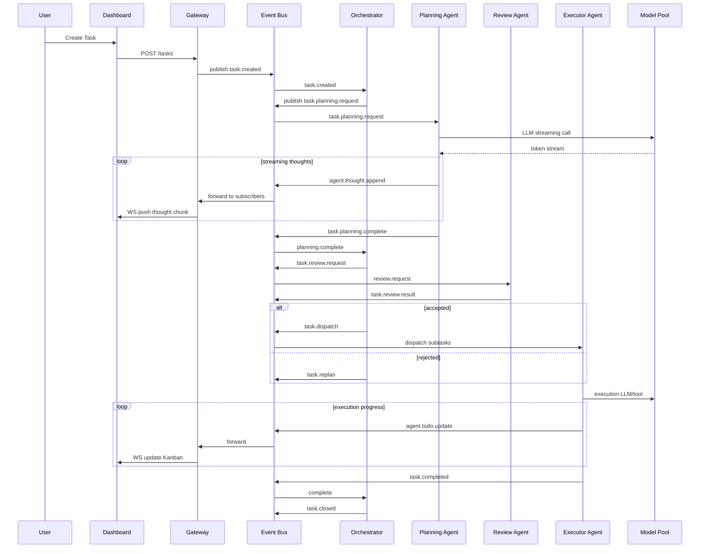

# Edict Agent 架构重设计文档

## 1. 设计目标
- **可观测性**：Dashboard 能实时显示每个 agent 的思考流（thoughts）和 todo 变更。
- **可重放 & 审计**：所有事件和状态变更持久化，可回溯。
- **可控流程**：保留三省六部逻辑，事件驱动，支持人工干预。
- **实时与可扩展**：低延迟交互，支持水平扩展。
- **结构化任务与可插拔 skill**：todo 与思考结构化，便于 UI 渲染和再利用。

## 2. 总体组件
1. **API Gateway / Control Plane**（REST + WebSocket）
2. **Orchestrator（调度核心）**
3. **Event Bus / Stream Layer**（Redis Streams / NATS / Kafka）
4. **Agent Runtime Pool**
5. **Model / LLM Pool**
6. **Task Store / Audit DB**（Postgres + JSONB）
7. **Realtime Dashboard**（WebSocket 客户端）
8. **Observability / Tracing**（Prometheus + Grafana + OpenTelemetry）

## 3. 通信模式
- **Event-Driven**: 所有 agent 间通信通过 Event Bus
- **主题示例**: `task.created`, `task.planning`, `task.review.request`, `task.review.result`, `task.dispatch`, `agent.thoughts`, `agent.todo.update`, `task.status`, `heartbeat`
- **事件结构**:
```json
{
  "event_id": "uuid",
  "trace_id": "task-uuid",
  "timestamp": "2026-03-01T12:00:00Z",
  "topic": "agent.thoughts",
  "event_type": "thought.append",
  "producer": "planning-agent:v1",
  "payload": { ... },
  "meta": { "priority": "normal", "model": "gpt-5-thinking", "version": "1" }
}
```

## 4. Thoughts 与 Todo JSON Schema
**Thought**:
```json
{
  "thought_id": "uuid",
  "trace_id": "task-uuid",
  "agent": "planning",
  "step": 3,
  "type": "reasoning|query|action_intent|summary",
  "source": "llm|tool|human",
  "content": "text",
  "tokens": 123,
  "confidence": 0.86,
  "sensitive": false,
  "timestamp": "2026-03-01T12:00:01Z"
}
```
**Todo**:
```json
{
  "todo_id": "uuid",
  "trace_id": "task-uuid",
  "parent_id": null,
  "title": "Verify data source X",
  "description": "拉取 X 表的最近 30 天记录，检查缺失值",
  "owner": "exec-dpt-1",
  "assignee_agent": "data-agent",
  "status": "open",
  "priority": "high",
  "estimated_cost": 0.5,
  "created_by": "planner",
  "created_at": "2026-03-01T12:01:00Z",
  "checkpoints": [ {"name":"fetch","status":"done"}, {"name":"validate","status":"pending"} ],
  "metadata": { "requires_human_approval": true }
}
```

## 5. 时序图（Mermaid）


## 6. WebSocket 订阅与消息示例
**订阅消息**:
```json
{
  "type": "subscribe",
  "channels": ["task:task-123", "agent:planning-agent", "global"]
}
```
**Thought 追加（partial）**:
```json
{
  "event": "agent.thought.append",
  "data": {
    "thought_id": "th-1",
    "step": 3,
    "partial": true,
    "type": "reasoning",
    "content": "We should split the task into...",
    "tokens": 15
  }
}
```
**Todo 更新**:
```json
{
  "event": "agent.todo.update",
  "data": {
    "todo_id": "todo-1",
    "status": "in_progress",
    "progress": 0.45
  }
}
```

## 7. 人工干预示例
```json
{
  "type": "command",
  "action": "pause_task",
  "trace_id": "task-123"
}
```
发布事件：
```json
{
  "event": "task.status",
  "data": {"status": "paused", "reason": "User intervention"}
}
```

## 8. Replay / 回放
- 请求：`GET /tasks/task-123/events`
- 返回事件数组，可在 Dashboard 时间轴逐条回放

## 9. 技术栈建议
| 层 | 技术 |
|----|------|
| Event Bus | Redis Streams |
| API | FastAPI |
| WS | FastAPI WebSocket |
| DB | Postgres |
| Agent Runtime | Python asyncio worker |
| Frontend | React + Zustand |

---
**备注**：此文档为可直接下载参考的架构设计，包含事件规范、WebSocket 协议、时序图和 JSON Schema，可用于实现实时 agent 可观测系统。

